# 👋 Hey, I'm Santosh Kumawat

### Full-Stack Developer | Java & Spring Boot | React | Exploring AI 🤖

  

  
  
  
  
  

---

I'm a software developer who enjoys building practical applications and scalable backend systems.

My primary experience is with **Java, Spring Boot, React, REST APIs, databases, and cloud technologies**.

Currently, I'm expanding my skills beyond traditional web development and exploring **Artificial Intelligence, Generative AI, LLMs, and AI-powered applications**.

---

## 🚀 About Me

* 💻 Full-Stack Developer focused on **Java & Spring Boot**
* ⚛️ Building modern applications with **React**
* ☁️ Working with **AWS & Google Cloud**
* 🐳 Working with **Docker & Kubernetes**
* 🔧 Building and consuming **REST APIs**
* 🤖 Exploring **AI, Generative AI & LLM applications**
* 🛠️ Interested in building real-world products and developer tools
* 📚 Always learning and experimenting with new technologies

---

## 🧰 Tech Stack

### 💻 Languages

### ⚙️ Backend

### 🎨 Frontend

### 🗄️ Databases

### ☁️ Cloud & DevOps

### 🤖 Currently Exploring AI

* Generative AI
* Large Language Models (LLMs)
* Prompt Engineering
* AI APIs & AI-powered applications
* Retrieval-Augmented Generation (RAG)
* AI Agents
* Machine Learning fundamentals

---

## 🌟 Featured Project

### 💰 Expensely

**Personal Expense & Income Tracker**

Expensely is a personal finance application designed to make tracking expenses and income simple.

### ✨ Features

* 📊 Dedicated Dashboard
* 💸 Expense Management
* 💰 Income Tracking
* 🔄 Recurring Expenses
* 📈 Spending Analytics
* 🎨 Multiple Predefined Themes
* 👤 Profile Management
* 🔐 OTP-based Authentication
* 📱 Android WebView Application
* 🧭 Bottom Navigation

### 🛠️ Tech

**React 18 · Spring Boot 3 · MongoDB · Netlify · Render · Android WebView**

---

## 🌐 Personal Portfolio

  

---

## 📊 GitHub Stats

  
  

---

## 🔥 GitHub Streak

  

---

## 🐍 Contribution Graph

  <picture>
    <source
      media="(prefers-color-scheme: dark)"
      srcset="https://raw.githubusercontent.com/santoshkumawat/santoshkumawat/output/github-contribution-grid-snake-dark.svg"
    />
    <source
      media="(prefers-color-scheme: light)"
      srcset="https://raw.githubusercontent.com/santoshkumawat/santoshkumawat/output/github-contribution-grid-snake.svg"
    />
    
  </picture>

---

## 🤝 Connect With Me

---

### 💡 Build. Learn. Improve. Repeat.

⭐ Feel free to explore my repositories and projects.

